# 基于SpringBoot的宠物领养管理系统的设计与实现

> 公开脱敏版：保留论文正文与技术插图；学校模板、页眉页脚、校徽、身份元数据不进入公开文件，含个人资料或凭据的截图已隐藏。

目 录

## 绪论

### 选题背景

在现代社会，养宠物已经成为一种普遍的生活方式。越来越多的人选择在家中饲养宠物，无论是狗、猫、小鸟还是其他小动物，它们都成为了人们生活中不可或缺的一部分。养宠物不仅可以给人们带来快乐和陪伴，还可以缓解生活压力、增加幸福感。然而，与宠物相关的管理问题也逐渐凸显出来。目前，宠物领养渠道不够透明，导致一些宠物被遗弃或者流浪；宠物寄养服务不够规范，存在安全隐患和信息不对称的情况；同时，一些流浪宠物无人救助，生存环境堪忧。这些问题不仅影响了宠物本身的幸福和安全，也给社会带来了一定的负面影响。

为解决这些问题，建立一套高效、安全、便捷的宠物领养管理系统势在必行。该系统将通过透明的宠物领养渠道和规范的宠物寄养服务，为宠物提供一个安全的生活环境；通过对流浪宠物的救助和管理，提高流浪宠物的生存率和幸福指数；通过整合宠物用品销售和订单处理，为宠物主人提供便捷的购物体验。通过建立这样一套系统，不仅可以改善宠物领养管理的现状，也可以促进社会对宠物的更好关爱和保护，实现宠物与人类共同生活的和谐共处。

### 国内外发展现状

国内外宠物领养管理系统的发展现状显示出了日益增长的需求和潜力。在国外，一些发达国家已经建立了成熟的宠物领养管理系统，如美国的Petfinder、英国的Blue Cross等。这些系统通过在线平台集中展示各类待领养的宠物信息，提供方便快捷的领养渠道，极大地促进了流浪宠物的救助和领养，并加强了社会对宠物保护的意识。同时，一些专业的宠物寄养服务平台也在不断涌现，提供专业化的宠物寄养服务，受到了宠物主人的青睐。

在国内，随着经济水平的提高和人们生活方式的改变，养宠物已经成为越来越多人的选择。近年来，国内的宠物领养管理系统也逐渐兴起。一些宠物领养平台如喵宠、爱宠网等开始崭露头角，提供宠物领养、寄养等服务，方便了宠物爱好者的选择。同时，一些知名电商平台也在积极拓展宠物用品销售渠道，为宠物主人提供了更为便捷的购物体验。然而，与国外相比，国内的宠物领养管理系统仍存在诸多不足，如信息不够透明、规范性不高、服务水平参差不齐等问题，还有待进一步完善和提高。

综上所述，国内外宠物领养管理系统的发展现状呈现出蓬勃发展的态势，但也面临着诸多挑战和机遇。未来，随着社会对宠物保护意识的提高和宠物市场的不断成熟，宠物领养管理系统将会迎来更加广阔的发展空间，为促进宠物与人类社会的和谐共生做出更大的贡献。

### 目的与意义

宠物领养管理系统的建立旨在解决当前宠物领养和寄养过程中存在的诸多问题，提升宠物领养管理的规范性和透明度。其主要目的和意义如下：

促进宠物保护：建立宠物领养管理系统有助于提高对流浪宠物的救助和管理效率，减少流浪宠物的数量，降低其生存风险，从而促进宠物保护事业的发展。

优化宠物领养渠道：通过建立透明、规范的宠物领养渠道，方便宠物爱好者寻找心仪的宠物，减少宠物被遗弃或流浪的现象，提高宠物领养的成功率。

提升宠物寄养服务质量：宠物寄养是许多宠物主人在出行期间的必需选择，建立宠物寄养管理系统可以提供规范化的寄养服务流程，确保宠物在寄养过程中得到良好的照顾和管理。

促进宠物与人类社会的和谐共处：宠物是人类的朋友和伙伴，建立宠物领养管理系统有助于促进宠物与人类社会的和谐共处，增强人们对宠物的关爱和保护意识，营造良好的宠物保护氛围。

提升社会责任感：宠物领养是一种社会责任，建立宠物领养管理系统有助于引导人们养成负责任的宠物养育观念，培养社会成员的责任意识和爱心素质。

综上所述，建立宠物领养管理系统不仅有助于改善宠物领养管理的现状，还可以促进宠物保护事业的发展，提升社会的文明程度和责任感，为宠物与人类社会的和谐共处提供更好的保障和支持。

## 关键技术介绍

### 关键性开发技术介绍

#### Spring Boot

Spring Boot是Spring框架的进化产物，以其约定大于配置的理念，极大地简化了Spring框架的配置繁琐性。通过引入Spring Boot Starter和结合Maven工具，开发人员能够迅速搭建起整合了Spring、Spring MVC、MyBatis等框架的系统，形成一套高效的SSM框架。

它就像一把魔法钥匙，能够以惊人的速度解锁开发过程中的诸多烦扰。Spring Boot通过一系列默认配置，让开发者可以不再为琐碎的配置而烦恼，而是专注于业务逻辑的实现。它的独特之处在于不仅仅提供了快速搭建的能力，还通过内置Tomcat服务器的方式，使得整个开发过程更加轻松，不再需要额外的服务器配置和部署步骤。

#### Vue

Vue是一种流行的JavaScript前端框架，以其简洁易用、响应式数据绑定、组件化开发等特点而闻名。在宠物领养管理系统中，Vue扮演着关键角色。它帮助开发者构建交互性强、用户友好的界面，通过数据绑定和事件处理实现页面与用户的交互功能，提升用户体验。Vue的组件化开发能够有效管理和复用系统中的功能模块，提高了系统的可维护性和扩展性。同时，Vue的响应式数据绑定机制确保了数据变化时界面的及时更新，保证系统的实时性和准确性。在构建单页面应用时，Vue Router提供了便捷的路由管理工具，使得用户操作更加流畅和自然。综上所述，Vue在宠物领养管理系统中发挥着重要作用，为系统的开发提供了高效、响应式的解决方案。

#### 阿里云RDS

阿里云RDS（Relational Database Service）是阿里云提供的一种云数据库服务。它支持多种关系型数据库引擎，包括MySQL、SQL Server、PostgreSQL、MariaDB和PPAS（阿里云自主研发的高度兼容Oracle数据库引擎）。用户可以根据自己的需求选择适合的数据库引擎，并在云上快速部署、运行和管理数据库实例。RDS提供了自动备份、故障恢复、监控报警、安全防护等一系列功能，帮助用户降低数据库运维成本，提高数据安全性和可靠性。同时，RDS还支持弹性扩展和自动化运维，可以根据业务需求随时调整数据库实例规格，保障业务的稳定性和高可用性。

#### MyBatis

MyBatis是一种Java持久层框架，它提供了一种优雅的方式来将Java对象与数据库表进行映射，并通过XML或注解配置SQL语句，实现了对数据库的访问操作。MyBatis具有简单易用、灵活性高、性能优越等特点。

在宠物领养管理系统中，MyBatis扮演着重要角色。首先，MyBatis通过配置SQL语句，实现了对数据库的CRUD操作，包括查询、插入、更新和删除等，使得开发者能够以面向对象的方式操作数据库，提高了开发效率。其次，MyBatis支持动态SQL语句的生成，能够根据不同的条件动态拼接SQL语句，实现灵活的数据查询和操作。此外，MyBatis还提供了一级缓存和二级缓存机制，能够有效地减少数据库访问次数，提升系统的性能和响应速度。综上所述，MyBatis在宠物领养管理系统中发挥着重要作用，通过简单灵活的方式实现了对数据库的访问操作，提高了系统的开发效率和性能表现。

### 其它相关技术

#### HTTP请求

HTTP（Hypertext Transfer Protocol）是一种用于传输超文本数据的应用层协议，它是Web的基础之一。通过HTTP协议，客户端（通常是浏览器）可以向服务器发送请求，并从服务器接收响应，实现了客户端与服务器之间的通信和数据交换。

在宠物领养管理系统中，HTTP请求技术扮演着至关重要的角色。首先，宠物领养管理系统通常是基于Web的应用程序，客户端需要向服务器发送各种类型的请求，如获取宠物信息、提交订单、更新用户信息等。HTTP请求技术通过定义不同的请求方法（如GET、POST、PUT、DELETE等），实现了对不同操作的标准化和规范化，确保了请求的准确性和有效性。其次，HTTP请求技术支持在请求头中添加各种参数和信息，如请求头、请求体、Cookie等，可以传递用户身份认证信息、请求参数等，从而实现了用户身份的验证和数据的传递。此外，HTTP请求技术还支持跨域请求、文件上传、会话管理等功能，为宠物领养管理系统的开发和运行提供了丰富的功能和灵活性。

## 系统分析

### 功能性需求分析

宠物领养管理系统旨在构建一个完善的平台，以满足管理员和用户在宠物领养管理方面的各种需求。管理员角色拥有系统的最高权限，能够对系统所有数据进行管理和维护。管理员需要实现登录功能，以确保系统安全性，并能够查看和编辑个人信息，同时具备修改密码的功能以保障账户安全。管理员还需要能够对宠物信息、宠物房间、宠物领养、宠物寄养、宠物用品、订单信息、流浪宠物上报、系统公告、管理员信息以及用户信息等进行全面管理。

宠物信息管理模块包括对平台所有宠物信息的管理，管理员可以添加、编辑、删除宠物信息，并确保信息的准确性和完整性。宠物房间管理模块用于管理所有宠物房间的分配和释放，以便在用户寄养宠物时进行有效的分配和管理。宠物领养管理模块允许管理员管理用户在平台领养的宠物，包括审批领养申请、记录领养历史等功能。宠物寄养管理模块用于管理用户在平台寄养的所有宠物，包括分配房间、寄养结束的房间释放等功能。宠物用品管理模块用于管理平台上所有的宠物用品信息，管理员可以添加新的宠物用品、编辑已有信息，并确保用品信息的更新和完整。订单信息管理模块用于管理用户购买宠物用品的所有订单，管理员可以对订单进行查看、处理和跟踪发货情况。

流浪宠物上报管理模块用于管理用户向平台上报的所有流浪宠物信息，管理员可以处理上报信息，将已处理的信息更新为已处理状态，并将救助回来的宠物信息上传到平台供用户领养。系统公告管理模块用于管理平台的系统公告，管理员可以发布、编辑、删除系统公告以及对公告进行定时发布。管理员信息管理模块用于管理管理员的信息，包括添加新管理员、编辑管理员信息、删除管理员等功能。用户信息管理模块用于管理平台的用户信息，包括查看用户信息、编辑用户信息、禁止用户等功能。

通过以上功能模块的完善设计和实现，宠物领养管理系统将能够为管理员和用户提供一个高效、便捷、安全的宠物领养管理平台，满足他们的各种需求，提升宠物领养管理的规范性和用户体验。

#### 前台用户用例描述

前台用户主要拥有登录，注册，个人信息修改，系统公告查看，宠物用品查看，购买，宠物领养，寄养，流浪宠物上报等功能，用例图如图3.1所示。

图3.1 前台用户用例图

注册登录用例描述如表3.1所示，主要阐述了前台用户注册登录必要流程。

表3.1 注册登录

<table>
<tr><td>用例名称</td><td>注册登录</td></tr>
<tr><td>参与者</td><td>前台用户</td></tr>
<tr><td>描述</td><td>输入账号，两次密码进行系统注册 登录时，输入注册成功的账号与密码，选择登录的角色类型进行系统登录</td></tr>
<tr><td>前置条件</td><td>无</td></tr>
<tr><td>后置条件</td><td>无</td></tr>
<tr><td>事件流</td><td>输入账号与密码 系统对账号进行唯一性判断，如果判断未通过，提示账号重复，对密码进行两次确认判断，如果判断未通过，提示密码错误 注册时，对密码进行签名加密处理，保证用户信息安全 进行登录，输入账号与密码 系统对账号与密码进行验证，验证同时对密码进行加密处理，如果验证通过，系统跳转首页，如果验证未通过，提示账号或密码错误</td></tr>
</table>

宠物信息用例由4部分组成：宠物信息查看，宠物领养，宠物寄养，流浪宠物上报，这是一个闭环用例，前台用户可以领养他人用户上报的流程宠物，用例描述如表3.2所示。

表3.2 宠物信息

<table>
<tr><td>用例名称</td><td>宠物信息管理</td></tr>
<tr><td>参与者</td><td>前台用户</td></tr>
<tr><td>描述</td><td>成功登入系统的用户可以进行流浪宠物信息查看 可以进行流程宠物领养，可以查看个人的领养记录，并进行放弃领养 可以进行宠物寄养 可以上报自己发现的流程宠物</td></tr>
<tr><td>前置条件</td><td>前台用户成功登入系统</td></tr>
<tr><td>后置条件</td><td>无</td></tr>
<tr><td>事件流</td><td>登入用户进入系统首页，查看本系统中所有流程宠物信息 选择某一个流程宠物，进行领养操作，领养成功可以在领养记录中查看个人领养信息，并进行放弃领养操作 进行宠物寄养操作，输入宠物昵称，选择寄养时间，输入寄养天数，发布成功后，等待后台确认，后台确认通过，即开始寄养操作 选择流浪宠物照片，输入理由，点击发布，等待后台确认，后台确认通过后，他人用户可以在流浪宠物信息查看界面中进行流浪宠物领养</td></tr>
</table>

宠物用品用例是一个小型商店用例，帮助该平台进行盈利与流量变现，使其更好管理流浪宠物，用例描述如表3.3所示。

表3.3 宠物用品

<table>
<tr><td>用例名称</td><td>宠物用品</td></tr>
<tr><td>参与者</td><td>前台用户</td></tr>
<tr><td>描述</td><td>登录过的前台用户可以查看本系统中所有与宠物有关的商品 进行商品的购买，后台接收到购买订单后，即可开始配送 前台用户可以在订单信息界面中查看本人的购买数据</td></tr>
<tr><td>前置条件</td><td>前台用户成功登入系统</td></tr>
<tr><td>后置条件</td><td>无</td></tr>
<tr><td>事件流</td><td>登录系统，进入宠物用品信息界面，查看本系统所有宠物用品信息（价格，图片，名称，数量） 选择用品，选择数量，进行下单，下单时系统自动生成订单编号，系统扣除用户余额 输入配送信息，等待后台审核配送 订单信息界面中，查看自己下单的用品信息与订单状态信息，进行收货处理</td></tr>
</table>

登录过的前台用户可以修改个人基本信息，包括名称的修改，电话的修改，邮箱地址的修改，头像的修改，用例描述如表3.4所示。

表3.4 个人信息编辑

<table>
<tr><td>用例名称</td><td>个人信息编辑</td></tr>
<tr><td>参与者</td><td>前台用户</td></tr>
<tr><td>描述</td><td>成功登入系统的前台用户，修改个人基本信息</td></tr>
<tr><td>前置条件</td><td>前台用户成功登入系统</td></tr>
<tr><td>后置条件</td><td>无</td></tr>
<tr><td>事件流</td><td>点击个人头像，进行基本信息的修改 系统对电话，邮箱地址进行唯一性判断，如果判断未通过，提示用户信息重复 修改成功后，界面自动展示最新的个人基本信息</td></tr>
</table>

#### 后台用户用例描述

后台用户主要负责数据维护和审核工作，主要包括数据维护、数据审核、领养申请管理、订单审核、房间管理等功能。数据维护功能涉及对系统数据的维护和更新，确保数据的准确性和完整性。数据审核功能包括对前台用户申报的流浪宠物信息和下单的订单信息进行审核，确保信息的真实性和合规性。领养申请管理功能允许后台用户审批和处理前台用户提交的宠物领养申请，确保领养流程的顺利进行。订单审核功能使后台用户能够审查和处理前台用户下单的订单信息，包括确认订单、发货处理等。房间管理功能涉及对宠物寄养时分配的房间进行管理和调配，确保房间的合理利用和宠物的安全舒适。通过以上功能，后台用户能够对前台用户数据进行管理，对领养申请和订单信息进行审核，以及对房间进行合理管理，保障系统运行的稳定和顺畅。用例图如图3.2所示。

图3.2 后台用户用例图

后台管理员可以进行前台用户数据管理，主要是后台增加，删除，修改前台用户，用例描述如表3.5所示。

表3.5 前台用户管理

<table>
<tr><td>用例名称</td><td>前台用户管理</td></tr>
<tr><td>参与者</td><td>后台用户</td></tr>
<tr><td>描述</td><td>列表查询前台用户 新增前台用户 修改个前台用户基本信息 删除前台用户</td></tr>
<tr><td>前置条件</td><td>后台用户通过账号与密码登入系统</td></tr>
<tr><td>后置条件</td><td>无</td></tr>
<tr><td>事件流</td><td>可以进行前台用户登录账号查询与分页查询 可以对步骤1的查询结果中的某一项进行删除操作，删除成功后，与该用户有关的所有数据将不复存在 可以对步骤1的查询结果中的某一项数据进行修改操作，修改头像，登录账号，姓名，电话等基本信息，系统同样需要对这些基本信息进行唯一性判断，如果判断未通过，将提示后台用户数据重复 可以进行前台用户添加操作，添加的同时，同样需要对这些基本信息进行唯一性判断，如果判断未通过，将提示后台用户数据重复</td></tr>
</table>

系统公告管理用例，后台管理员用户可以进行系统公告的添加，删除，修改操作及时更新系统动态，提高用户体验，具体如表3.6所示。

表3.6 系统公告管理

<table>
<tr><td>用例名称</td><td>前台用户管理</td></tr>
<tr><td>参与者</td><td>后台用户</td></tr>
<tr><td>描述</td><td>查询公告内容 增加公告内容 删除公告内容 修改公告内容</td></tr>
<tr><td>前置条件</td><td>后台用户通过账号与密码登入系统</td></tr>
<tr><td>后置条件</td><td>无</td></tr>
<tr><td>事件流</td><td>通过公告标题查询公告内容 可以对步骤1的查询结果中的某一项进行删除操作，删除成功后，该公告内容将无法被看到 可以对步骤1的查询结果中的某一项数据进行修改操作，修改后，系统自动展示最新的内容 可以进行前台用户添加操作，添加成功后，该公告内容被展示时将自动置顶</td></tr>
</table>

宠物信息管理用例中，后台可以增加宠物数据，查看前台用户的领养记录，审核前台用户提交的流程宠物申报请求，具体如表3.7所示。

表3.7 宠物信息管理

<table>
<tr><td>用例名称</td><td>宠物信息管理</td></tr>
<tr><td>参与者</td><td>后台用户</td></tr>
<tr><td>描述</td><td>宠物信息界面，进行宠物信息的新增，修改，删除，查询 领养数据管理界面，进行宠物选择，状态选择，如果有被领养，可可以进行放弃领养操作，使宠物回归未被领养状态 流浪宠物领养管理中，进行前台用户上传的流浪宠物数据审核，审核通过，前台用户可以领养此宠物</td></tr>
<tr><td>前置条件</td><td>后台用户通过账号与密码登入系统</td></tr>
<tr><td>后置条件</td><td>无</td></tr>
<tr><td>事件流</td><td>后台用户进入宠物界面，可以进行宠物名称查询，并可以对查询的结果进行编辑与删除操作 在宠物信息界面进行删除操作，被删除的数据将不复存在，包括已经存在的领养数据 在宠物信息界面，后台用户可以进行增加操作，增加成功的宠物可以被前台用户领养 在宠物信息界面，后天用户可以进行编辑操作，被编辑后的宠物，将同步更新给前台用户 后台用户进入领养管理界面，用户可以进行宠物与状态的筛选，可以对筛选后的结果进行放弃领养操作，放弃领养后，宠物将回归待领养状态，可以被其他前台用户领养 流浪宠物界面中，后台用户可以审核处理状态的筛选，可以对被筛选的结果进行已处理操作，处理通过的宠物将可以被其他前台用户领养</td></tr>
</table>

寄养管理用例中，主要涉及到房间分配流程，后台管理用户可以进行房间管理与寄养管理，寄养与房间为一对一关系，一个宠物被寄养在一个房间中，具体如表3.8所示。

表3.8 寄养管理

<table>
<tr><td>用例名称</td><td>寄养管理</td></tr>
<tr><td>参与者</td><td>后台用户</td></tr>
<tr><td>描述</td><td>房间数据的增加，删除，修改，查询 寄养数据的查询，房间分配，开始寄养</td></tr>
<tr><td>前置条件</td><td>后台用户通过账号与密码登入系统</td></tr>
<tr><td>后置条件</td><td>无</td></tr>
<tr><td>事件流</td><td>进入房间信息界面，进行房间编号的查询 点击新增按钮，后台用户输入房间编号，完成房间新增 后台用户可以修改房间编号，可以删除被弃用的房间，房间被删除后将无法在系统其他用例中被查询出来 后台用户进入寄养信息界面，可以进行寄养状态的选择（待确认，寄养中，已领回） 后台用户在寄养信息界面中，可以对待确认的寄养数据进行房间分配操作，点击分配按钮，选择空闲的房间，进行寄养 可以对寄养中的数据，进行领回操作，点击领回按钮，代表寄养已经完成 寄养信息状态操作，将同步给被寄养的宠物的主人（前台用户）</td></tr>
</table>

宠物用品管理用例中，后台用户可以进行宠物用品信息的维护，可以进行订单发货处理，具体如表3.9所示。

表3.9 宠物用品管理

<table>
<tr><td>用例名称</td><td>宠物用品管理</td></tr>
<tr><td>参与者</td><td>后台用户</td></tr>
<tr><td>描述</td><td>宠物用品的增加，删除，修改，查询 订单信息查询与发货</td></tr>
<tr><td>前置条件</td><td>后台用户通过账号与密码登入系统</td></tr>
<tr><td>后置条件</td><td>无</td></tr>
<tr><td>事件流</td><td>进入宠物用品信息界面，可以进行商品名称查询 点击新增按钮，选择商品图片，输入商品基本信息（名称，价格，数量）完成宠物用品新增，新增后的数据将同步展示给前台用户 后台用户可以对宠物用品进行删除操作，删除成功的宠物用品经将无法被前台用户查询 后台用户可以对宠物用品进行编辑，比如编辑图片，名称，价格等，编辑后的数据，将同步更新到前台 后台用户在订单信息界面中，进行订单编号查询 后台用户可以对未发货的订单进行发货操作 发货成功的订单，将同步给前台用户，前台用户可以对发货成功的订单进行收货操作</td></tr>
</table>

### 非功能性需求分析

性能要求： 系统应具备高性能，能够在高并发情况下稳定运行，响应速度快，页面加载迅速，保证用户体验。

安全性要求： 系统应采取必要的安全措施，包括用户身份认证、数据加密传输、防止SQL注入等，保障用户信息和数据的安全性和机密性。

可扩展性要求： 系统应具备良好的可扩展性，能够灵活应对未来的业务扩展和需求变化，方便添加新功能和模块。

可维护性要求： 系统应具备良好的代码结构和规范，易于理解和维护，便于团队合作开发和持续维护。

可靠性要求： 系统应具备高可靠性，能够持续稳定运行，避免因系统故障或异常导致的数据丢失或损坏。

易用性要求： 系统应具备良好的用户界面设计和交互设计，操作简单直观，用户能够轻松上手并快速完成所需操作。

跨平台性要求： 系统应支持跨平台部署，能够在不同的操作系统和硬件环境下运行，提高系统的灵活性和适用性。

数据一致性要求： 系统应保证数据的一致性，即使在高并发情况下，也要保证数据的准确性和完整性，避免数据冲突和重复。

容错性要求： 系统应具备良好的容错机制，能够识别和处理各种异常情况，确保系统在发生故障时能够快速恢复并保持可用状态。

### 可行性分析

宠物领养管理系统的设计和实现需要进行全面的可行性分析，包括技术可行性、经济可行性和操作可行性等方面。

从技术可行性角度来看，选择基于Spring Boot框架进行开发是合适的。Spring Boot是一种轻量级、快速开发的框架，具有丰富的生态系统和强大的功能，能够满足系统的需求。同时，采用MySQL作为后端数据库，Vue作为前端框架，这些技术都是成熟、稳定的，有大量的使用案例和社区支持，可以降低开发风险，提高开发效率。另外，采用前后端分离的架构模式，能够使系统更加灵活，便于后期维护和扩展。

在经济可行性方面，宠物领养管理系统具有较好的商业前景。随着人们对宠物关爱的增加，宠物行业呈现出快速增长的趋势，宠物领养管理系统可以满足用户对宠物领养、寄养等需求，具有较大的市场潜力。同时，系统的开发和运营成本相对较低，采用开源技术和云计算服务，能够降低系统建设和运维成本，提高投资回报率。

在操作可行性方面，宠物领养管理系统具有良好的用户体验和易用性。系统提供了清晰的用户界面和操作流程，用户可以轻松地完成注册、登录、领养等操作，减少了学习成本和使用难度。同时，系统提供了丰富的功能和服务，满足了用户对宠物领养管理的各种需求，能够提升用户满意度和粘性。

综合以上分析，宠物领养管理系统具有良好的可行性。技术上具备开发条件和支持，经济上有着较好的商业前景，操作上能够满足用户需求，因此值得进一步推进和实施。然而，需要在开发过程中注重项目管理和团队协作，确保项目按计划顺利完成，并及时进行市场推广，提升系统的影响力和竞争力

## 系统设计

### 架构设计

图4.1 系统架构图

1. 前端架构：

Vue：采用Vue作为主要的前端开发框架，确保在不同平台上保持一致的用户体验。

界面构建：采用Vue构建Web端界面，为了提高界面美观性和用户体验，整合 Element UI进行界面构造。

数据交互：通过Axios与Ajax进行前后端的数据交互，支持主要的HTTP请求类型，包括POST与GET。

2. 后端架构：

Spring Boot框架：作为服务端的主要开发框架，提供快速搭建与开发的优势，支持RESTful API的开发。

SSM架构：使用Spring、Spring MVC和MyBatis-plus的组合，实现了系统的业务逻辑、控制层和持久层的分离。

异常与返回处理：实现全局异常处理机制，确保系统在面对异常情况时能够友好地向前端返回响应。

数据交互与事务处理：利用ORM框架进行数据库操作，确保数据的一致性。采用声明式事务机制，保证用户操作的原子性。

3. 数据库：

MySQL数据库： 作为主要的数据存储方案，存储宠物寄养信息，领养信息，宠物用品信息，订单信息等数据。

4. 数据流与交互：

HTTP请求： 前端通过HTTP请求向后端API请求数据，包括用户信息、互助服务信息等。

后端处理： 后端接收到请求后，进行相应的业务处理，通过MyBatis与MySQL数据库交互，实现数据的增删改查。

Response返回： 后端将处理结果通过HTTP Response返回给前端，确保前后端之间的有效数据流。

### 功能设计

#### 前台用户登录与注册

首先，用户通过前端界面发起了注册请求， Controller接着调用Service层的register方法来处理注册逻辑。在Service层，首先检查了接收到的参数，包括用户名、密码和用户角色是否为空。然后调用userService.register方法，在这个方法中，将接收到的Account对象转换为User对象，并将其传递给Mapper层。Mapper层查询数据库，检查用户是否已经存在。如果用户不存在，就向数据库插入新用户信息；如果用户已存在，则抛出一个自定义的异常，提示用户已存在错误。最后，Controller返回注册成功的消息给用户，注册时序图如图4.2所示。

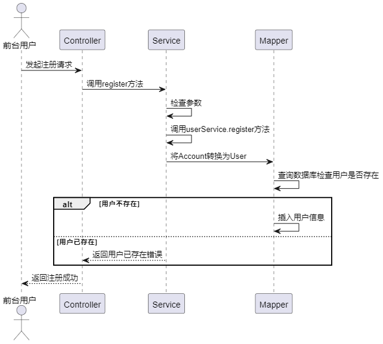

图4.2 注册时序图

用户通过前端界面发起登录请求，Controller捕获并调用Service层的login方法。在Service层，根据用户的角色（管理员或普通用户），分别调用了adminService.login方法和userService.login方法。在这两个方法中，首先通过Mapper层查询数据库获取用户信息。如果用户不存在，则返回用户不存在错误。如果用户存在，继续判断密码是否正确，如果密码错误，则返回用户密码错误；如果密码正确，则调用TokenUtils生成Token，并将Token返回给Service层。最后，Service层将用户信息和token返回给Controller，Controller将登录结果返回给用户，登录成功生成的Token将在服务端的拦截层进行是否登录的判断，满足登录拦截与数据安全的需求，登录时序图如图4.3所示。

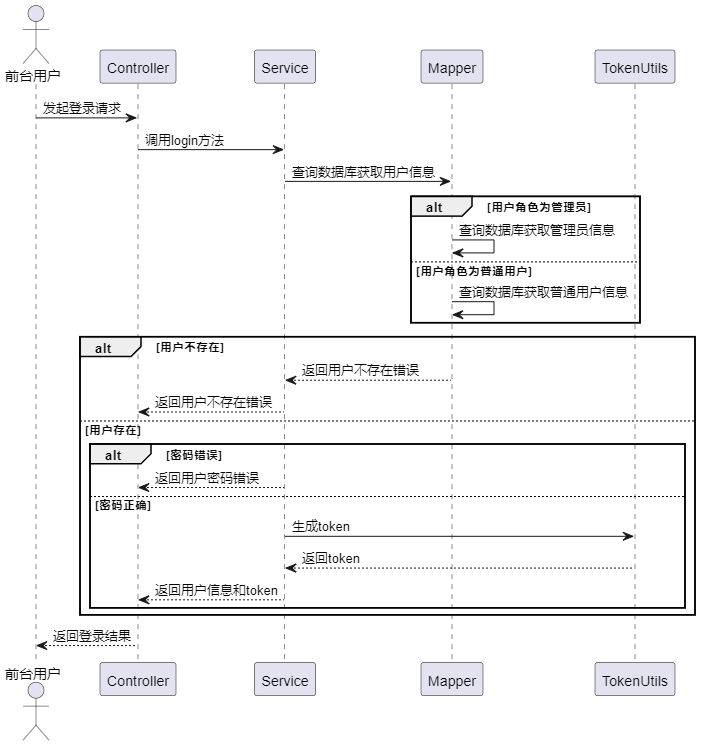

图4.3用户登录时序图

#### 宠物信息管理功能设计

宠物信息管理，宠物领养功能设计中，用户通过前端界面发起领养动物请求，Frontend捕获并向BackendController发起修改动物状态的请求。BackendController调用BackendService的updateById方法，更新动物状态。更新完成后，BackendService返回更新结果给BackendController，再由BackendController将结果返回给Frontend。随后，Frontend再向BackendController发起添加领养记录的请求，BackendController调用BackendService的add方法，向数据库插入领养记录。数据库返回插入结果给BackendService，BackendService再返回结果给BackendController，最终由BackendController将结果返回给Frontend，通过Frontend展示领养结果，时序图如图4.4所示。

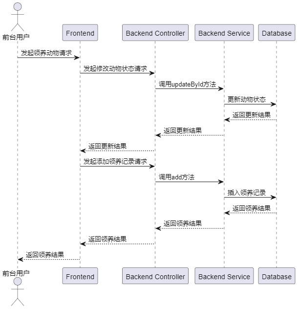

图4.4 宠物领养时序图

宠物寄养功能设计中，用户通过前端界面触发保存操作，前端根据表单是否存在id来构造请求数据，并向后端控制器发起新增或更新寄养信息的请求。后端控制器根据请求的URL选择调用add或update方法。后端服务调用对应的Mapper方法向数据库插入或更新寄养信息。数据库完成操作后，返回插入或更新结果给后端服务，后端服务再将结果返回给后端控制器，最终由后端控制器将结果返回给前端，时序图如图4.5所示。

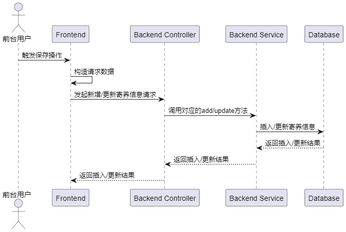

图4.5 宠物寄养时序图

流浪宠物上报功能设计中，用户通过前端界面触发保存操作，前端先进行表单数据的验证。验证通过后，前端向后端控制器发起新增或更新提交信息的请求。后端控制器根据请求的URL选择调用add或update方法。后端服务调用对应的Mapper方法向数据库插入或更新提交信息。数据库完成操作后，返回插入或更新结果给后端服务，后端服务再将结果返回给后端控制器，最终由后端控制器将结果返回给前端，时序图如图4.6所示。

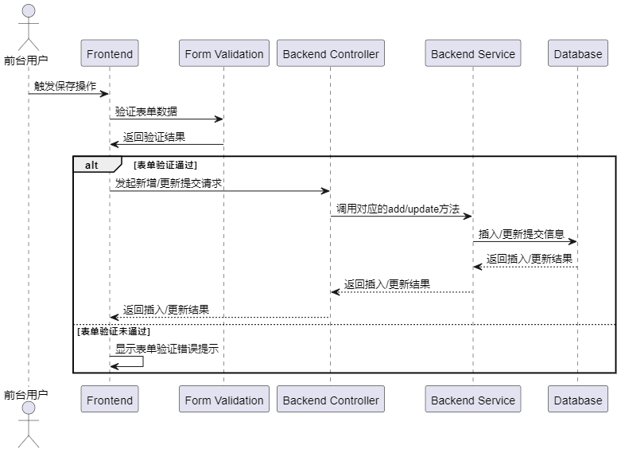

图4.6 流浪宠物上报

#### 宠物用品功能设计

宠物用品购买功能设计中，用户通过前端界面触发购买操作，前端构造订单数据并向后端控制器发起新增订单的请求。后端控制器调用BackendService的add方法。BackendService先查询数据库获取用户信息和商品信息。如果用户余额不足，则抛出余额不足错误，返回给前端。如果余额充足，则向数据库插入订单信息，并更新用户余额和商品库存。数据库完成操作后，返回结果给BackendService，BackendService再将结果返回给BackendController，最终由BackendController将结果返回给前端，时序图如图4.7所示。

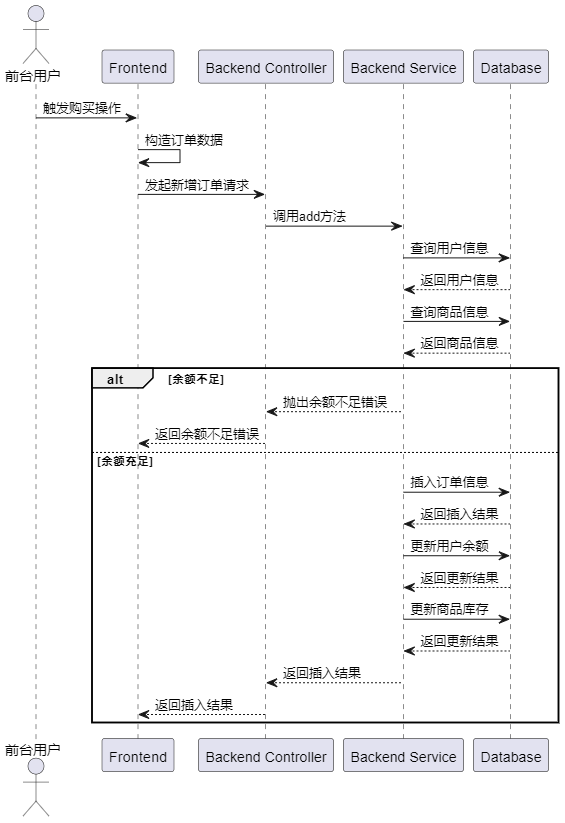

图4.7 宠物用品购买时序图

#### 个人信息修改功能设计

个人信息修改功能设计中，用户通过前端界面触发保存操作，前端向后端控制器发起更新用户信息的请求。后端控制器调用BackendService的updateById方法来更新用户信息。BackendService将更新请求发送给数据库，数据库完成更新操作后，返回更新结果给BackendService。BackendService再将结果返回给BackendController，最终由BackendController将结果返回给前端，时序图如图4.8所示。

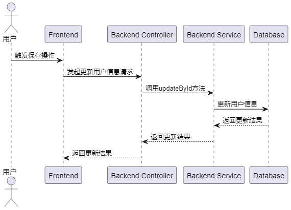

图4.8 个人信息修改时序图

#### 宠物信息管理功能设计

宠物信息新增功能设计中，后台用户通过前端界面触发保存操作，前端先进行表单数据的验证。验证通过后，前端向后端控制器发起新增或更新动物信息的请求。后端控制器调用BackendService的add或update方法来处理动物信息。BackendService将处理请求发送给数据库，数据库完成插入或更新操作后，返回结果给BackendService。BackendService再将结果返回给BackendController，最终由BackendController将结果返回给前端，时序图如图4.9所示。

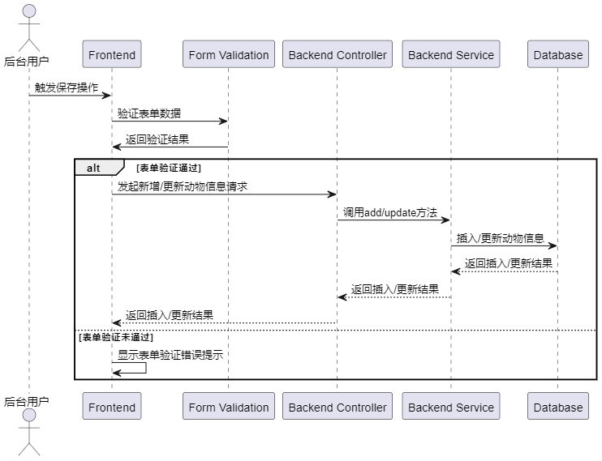

图4.9 宠物信息新增时序图

#### 寄养管理功能设计

宠物寄养管理功能设计中，用户通过前端界面触发保存操作。前端首先将当前表单数据构造成保存数据的格式。然后，前端向后端控制器发起新增或更新寄养信息的请求。后端控制器根据请求的URL选择调用updateById方法。BackendService接收到请求后，首先向数据库发起更新寄养信息的操作。数据库完成更新后，返回更新结果给BackendService。在更新寄养信息的同时，BackendService还根据寄养状态的不同，查询并更新相应的房间信息。如果寄养状态为领养中，BackendService将更新对应房间的状态为占用，并更新房间对应的宠物信息。如果寄养状态为已领养，BackendService将更新对应房间的状态为空闲，并将房间对应的宠物信息清空。最终，BackendService将更新结果返回给BackendController，BackendController再将结果返回给前端，时序图如图4.10所示。

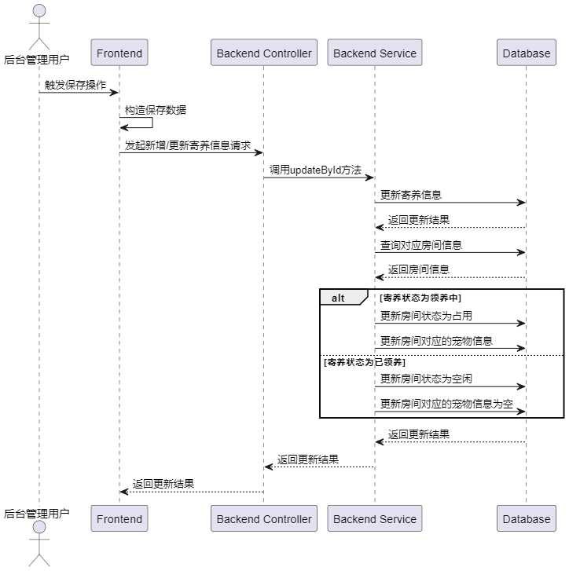

图4.10 宠物寄养管理时序图

### 数据库设计

#### E-R图设计

根据上述功能流程设计与需求分析中的功能需求分析可以得知，本系统需要具有10张表来完成：宠物寄养，宠物领养，前台用户管理，登录注册，流浪宠物申报等功能。

管理员表：用于存储管理员的信息，包括登录凭证和个人信息。

领养记录表：记录用户领养宠物的信息，包括领养时间、领养者ID和宠物ID等。

宠物信息表：存储所有宠物的基本信息，如宠物名称、年龄、性别、品种等。

寄养信息表：记录用户寄养宠物的信息，包括寄养时间、寄养者ID、宠物ID等。

宠物用品表：存储系统中所有的宠物用品信息，如名称、价格、库存量等。

公告信息表：用于存储系统发布的公告信息，如标题、内容、发布时间等。

订单信息表：记录用户购买宠物用品的订单信息，包括订单号、购买者ID、购买时间、商品ID等。

房间信息表：存储系统中的房间信息，用于宠物寄养管理，包括房间号、房间状态（占用/空闲）、宠物ID等字段。

上报信息表：记录用户上报的流浪宠物信息，包括宠物图片、描述、上报时间等。

用户信息表：用于存储系统中所有用户的信息，包括用户的登录凭证、个人信息等。

本系统的数据库实体关系如图4.11所示。

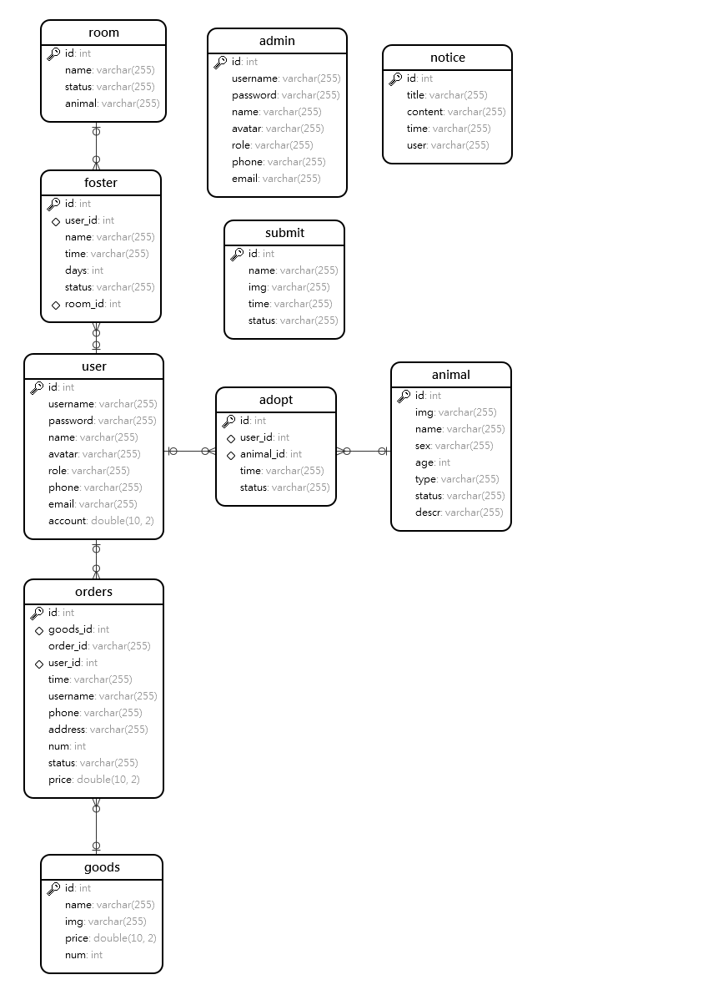

图4.11 E-R图

#### 数据库表设计

用户表主要字段为account表示余额，用以购买宠物用品时的金额计算，password与username用以登录，注册的条件判断，具体如表4.1所示

表4.1 用户表

<table>
<tr><td>字段名</td><td>数据类型</td><td>主键/允许空</td><td>字段含义</td></tr>
<tr><td>account</td><td>double(10,2)</td><td>NULL</td><td>余额</td></tr>
<tr><td>avatar</td><td>varchar(255)</td><td>NULL</td><td>头像</td></tr>
<tr><td>email</td><td>varchar(255)</td><td>NULL</td><td>邮箱</td></tr>
<tr><td>id</td><td>int</td><td>PRIMARY KEY</td><td>主键ID</td></tr>
<tr><td>name</td><td>varchar(255)</td><td>NULL</td><td>姓名</td></tr>
<tr><td>password</td><td>varchar(255)</td><td>NULL</td><td>密码</td></tr>
<tr><td>phone</td><td>varchar(255)</td><td>NULL</td><td>电话</td></tr>
<tr><td>role</td><td>varchar(255)</td><td>NULL</td><td>角色</td></tr>
<tr><td>username</td><td>varchar(255)</td><td>NULL</td><td>用户名</td></tr>
</table>

领养记录表主要字段为animal_id该表关联宠物信息表，系统可以根据这个字段查询哪些宠物被领养或者未被领养，user_id关联用户表，可以根据此字段查询领养人是谁，具体如表4.2所示。

表4.2 领养记录表

<table>
<tr><td>字段名</td><td>数据类型</td><td>主键/允许空</td><td>字段含义</td></tr>
<tr><td>animal_id</td><td>int</td><td>NULL</td><td>宠物ID</td></tr>
<tr><td>id</td><td>int</td><td>PRIMARY KEY</td><td>主键ID</td></tr>
<tr><td>status</td><td>varchar(255)</td><td>NULL</td><td>领养状态</td></tr>
<tr><td>time</td><td>varchar(255)</td><td>NULL</td><td>领养时间</td></tr>
<tr><td>user_id</td><td>int</td><td>NULL</td><td>用户ID</td></tr>
</table>

宠物信息表如表4.3所示，主要存储与宠物有关的基本信息比如图片，名字等。

表4.3 宠物信息表

<table>
<tr><td>字段名</td><td>数据类型</td><td>主键/允许空</td><td>字段含义</td></tr>
<tr><td>age</td><td>int</td><td>NULL</td><td>宠物年龄</td></tr>
<tr><td>descr</td><td>varchar(255)</td><td>NULL</td><td>宠物介绍</td></tr>
<tr><td>id</td><td>int</td><td>PRIMARY KEY</td><td>主键ID</td></tr>
<tr><td>img</td><td>varchar(255)</td><td>NULL</td><td>宠物图片</td></tr>
<tr><td>name</td><td>varchar(255)</td><td>NULL</td><td>宠物名字</td></tr>
<tr><td>sex</td><td>varchar(255)</td><td>NULL</td><td>宠物性别</td></tr>
<tr><td>status</td><td>varchar(255)</td><td>NULL</td><td>宠物状态</td></tr>
<tr><td>type</td><td>varchar(255)</td><td>NULL</td><td>宠物种类</td></tr>
</table>

寄养信息表如表4.4所示，记录了宠物寄养的详细信息，包括寄养天数（days）、宠物昵称（name）、寄养房间的ID（room_id）、寄养状态（status）、寄养时间（time）以及用户的ID（user_id）。其中，room_id是与房间信息表的外键关联，user_id是与用户信息表的外键关联。

表4.4 寄养信息表

<table>
<tr><td>字段名</td><td>数据类型</td><td>主键/允许空</td><td>字段含义</td></tr>
<tr><td>days</td><td>int</td><td>NULL</td><td>寄养天数</td></tr>
<tr><td>id</td><td>int</td><td>PRIMARY KEY</td><td>主键ID</td></tr>
<tr><td>name</td><td>varchar(255)</td><td>NULL</td><td>宠物昵称</td></tr>
<tr><td>room_id</td><td>int</td><td>NULL</td><td>房间ID</td></tr>
<tr><td>status</td><td>varchar(255)</td><td>NULL</td><td>寄养状态</td></tr>
<tr><td>time</td><td>varchar(255)</td><td>NULL</td><td>寄养时间</td></tr>
<tr><td>user_id</td><td>int</td><td>NULL</td><td>用户ID</td></tr>
</table>

订单表记录了包括送货地址（address）、商品ID（goods_id）、购买数量（num）、订单编号（order_id）、联系电话（phone）、订单价格（price）、订单状态（status）、下单时间（time）、用户ID（user_id）以及收货人（username）。其中，goods_id是与宠物用品表的外键关联，user_id是与用户信息表的外键关联，具体如表4.5所示。

表4.5 订单表

<table>
<tr><td>字段名</td><td>数据类型</td><td>主键/允许空</td><td>字段含义</td></tr>
<tr><td>address</td><td>varchar(255)</td><td>NULL</td><td>送货地址</td></tr>
<tr><td>goods_id</td><td>int</td><td>NULL</td><td>商品</td></tr>
<tr><td>id</td><td>int</td><td>PRIMARY KEY</td><td>主键ID</td></tr>
<tr><td>num</td><td>int</td><td>NULL</td><td>购买数量</td></tr>
<tr><td>order_id</td><td>varchar(255)</td><td>NULL</td><td>订单编号</td></tr>
<tr><td>phone</td><td>varchar(255)</td><td>NULL</td><td>联系电话</td></tr>
<tr><td>price</td><td>double(10,2)</td><td>NULL</td><td>订单价格</td></tr>
<tr><td>status</td><td>varchar(255)</td><td>NULL</td><td>订单状态</td></tr>
<tr><td>time</td><td>varchar(255)</td><td>NULL</td><td>下单时间</td></tr>
<tr><td>user_id</td><td>int</td><td>NULL</td><td>用户ID</td></tr>
<tr><td>username</td><td>varchar(255)</td><td>NULL</td><td>收货人</td></tr>
</table>

## 系统实现

### 前台登录注册实现

注册界面如图5.1所示，用户输入完账号与密码后，点击注册按钮，触发设定好的点击事件函数：register，函数中首先使用this.$refs['formRef'].validate进行表单验证，主要验证是否全部输入，两次输入的密码是否一致，验证通过，通过调用this.$request.post函数访问服务端注册接口register，在注册接口中后端首先对传来的参数进行检查，确保用户名、密码和角色都不为空，如果有为空的情况，则返回一个参数缺失的错误信息，调用userService的register方法。在userService的register方法中，首先根据用户名从数据库中查询是否已存在该用户，如果存在，则抛出一个用户已存在的自定义异常。接着，将用户的角色设置为USER，并调用userMapper的insert方法将用户信息插入到数据库中，服务端注册关键代码如下所示：

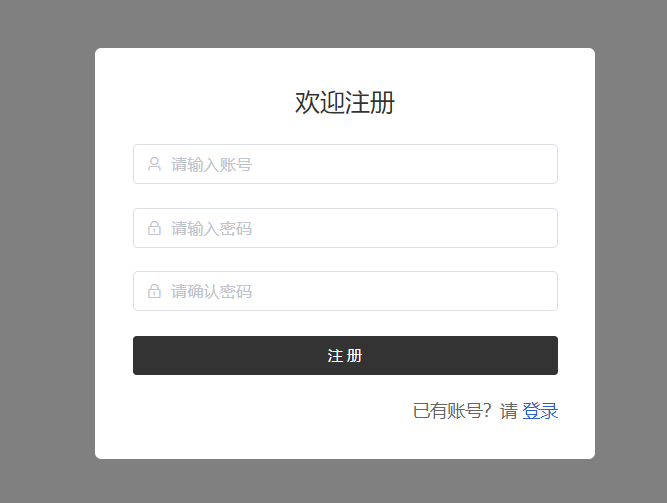

图5.1 前台注册

前台登录界面如前台注册界面基本一致，都是Form表单的形式，用户点击登录按钮，访问服务端接口login，由于管理员用户登录与前台用户登录使用的是同一个接口，因此系统会根据用户的选择（角色类型）访问不同的Service，如果角色是admin，则调用adminService的login方法，如果是user，则调用userService的login方法。

在login方法中，首先根据用户名从数据库中查询对应的用户信息。如果用户不存在，则抛出一个用户不存在的自定义异常。如果用户存在，但密码不匹配，则抛出一个用户账户错误的自定义异常。如果用户名和密码都匹配，则生成一个token，并将其设置到用户对象中，最后返回该用户对象，关键代码如下所示：

@PostMapping("/login")
public Result login(@RequestBody Account account) {
 if (ObjectUtil.isEmpty(account.getUsername()) || ObjectUtil.isEmpty(account.getPassword())
 || ObjectUtil.isEmpty(account.getRole())) {
 return Result.error(ResultCodeEnum.PARAM_LOST_ERROR);
 }
 if (RoleEnum.ADMIN.name().equals(account.getRole())) {
 account = adminService.login(account);
 }
 if (RoleEnum.USER.name().equals(account.getRole())) {
 account = userService.login(account);
 }
 return Result.success(account);
}

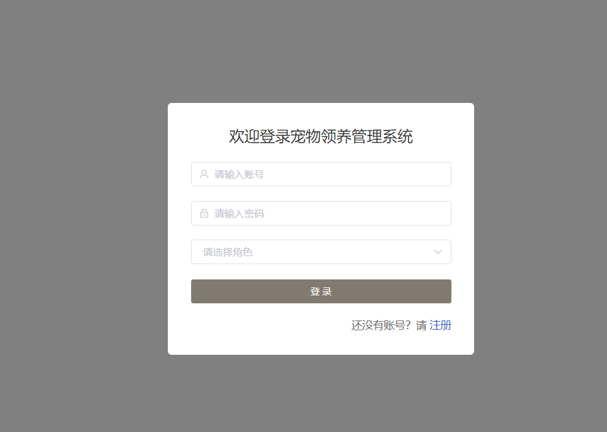

图5.2 App登录

### 宠物信息功能实现

#### 宠物信息查看

宠物信息查看界面如图5.3所示，界面整体布局为图卡形式，首先在Vue的初始生命周期created函数中调用loadAnimal函数，loadAnimal函数使用this.$request.get('/animal/selectAll')向服务端发起所有数据获取请求，服务端调用AnimalService的selectAll方法进行查询，在AnimalService类中，定义了一个名为selectAll的方法，该方法接受一个Animal对象作为参数，并调用animalMapper的selectAll方法执行查询操作，返回查询结果，Mapper使用MyBatis的XML映射文件中的<select>标签，其中定义了一个名为selectAll的查询语句。该查询语句会根据传入的Animal对象动态生成对应的SQL语句，查询animal表中的数据。查询条件包括根据id和name进行精确或模糊匹配。如果id和name字段不为空，则将其作为查询条件；如果为空，则不添加对应的查询条件。查询结果按照id字段降序排列，最后查询结果封装成Result对象返回给前端，前端接收到数据后，使用双向绑定将数据绑定给animalData，然后使用v-for循环接口返回的数据，在循环的过程通过:disabled="item.status === '已领养'"对宠物状态进行判断，实现领养按钮置灰处理，主要代码selectAll函数如下所示，主要操作了Mapper接口的selectAll方法，进行数据库查询。

<select id="selectAll" resultType="com.example.entity.Animal">
 select
 <include refid="Base_Column_List" />
 from animal
 <where>
 <if test="id != null"> and id= #{id}</if>
 <if test="name != null"> and name like concat('%', #{name}, '%')</if>
 </where>
 order by id desc
</select>

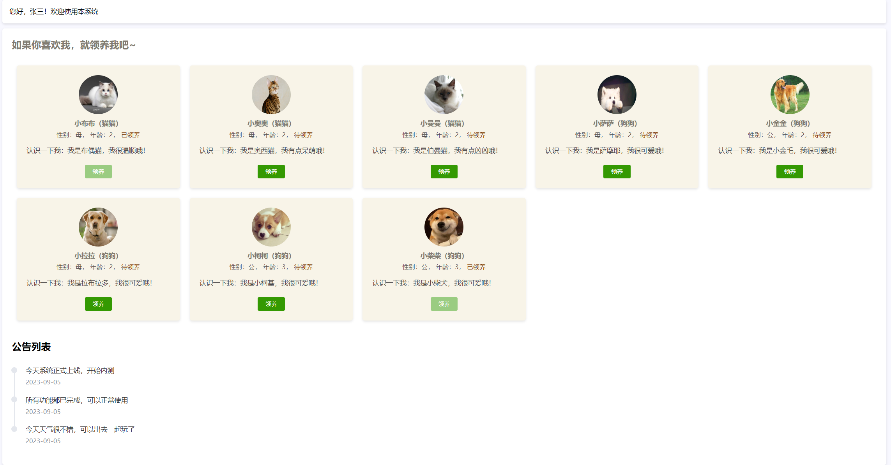

图5.3 宠物信息查看

#### 宠物领养

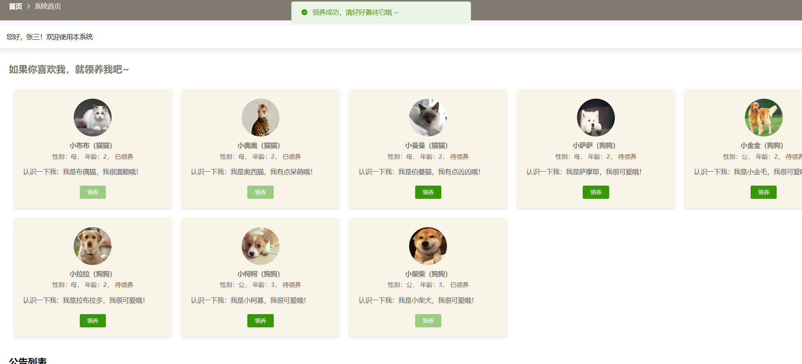

图5.4 宠物领养

宠物领养结果如图5.4所示，用户点击领养按钮，触发函数adopt，在此函数中向/animal/update接口发送请求，接口通过Update语句修改该宠物的状态，然后在此接口的回调函数中，向接口/adopt/add发送请求，增加该用户与该宠物的领养记录，主要代码如下所示，在add方法中，调用Mapper接口的insert方法，完成数据库的插入。

public void add(Adopt adopt) {
 adopt.setTime(DateUtil.now());
 adopt.setStatus(AdoptStatusEnum.ADOPT_YES.status);
 adoptMapper.insert(adopt);
}

宠物领养信息查看界面如图5.5所示，首先前端请求接口/adopt/selectPage，接口通过通过 TokenUtils.getCurrentUser() 方法获取当前用户信息，并判断用户角色是否为普通用户（USER）。如果是普通用户，则设置查询条件 adopt 的 userId 属性为当前用户的 id，这样可以确保普通用户只能查询与自己相关的领养记录。使用 PageHelper 工具类开始分页，指定当前页码 pageNum 和每页显示数量 pageSize。然后调用 adoptMapper 的 selectAll 方法进行查询，传入 adopt 对象作为查询条件。查询结果保存在列表 list 中，前端通过Element UI的Table组件渲染列表，然后操作按钮通过:disabled="scope.row.status === '已归还'"进行置灰处理，用户在获取列表数据的同时可以选择上方弹窗，进行条件查询，这里同样使用了MyBatis的动态SQL。

图5.5 宠物领养结果

用户点击放弃领养按钮，触发函数cancel，在函数中通过this.$confirm进行二次提醒，用户点击确认后，访问save函数调用/adopt/update接口，接口首先通过 if 语句判断领养记录的状态是否为“已归还”（ADOPT_CANCEL），如果是，则执行后续操作。如果领养记录状态为“已归还”，则需要将对应宠物的状态同步更新为“待领养”（ADOPT_NO）。通过 adopt 对象获取宠物ID，然后根据宠物ID查询对应的宠物信息，并将宠物状态更新为“待领养”。最后调用 animalMapper.updateById(animal) 方法将更新后的宠物信息写入数据库。无论领养记录状态是否为“已归还”，都需要将领养记录信息更新到数据库中。通过 adoptMapper.updateById(adopt) 方法实现更新操作。放弃领养界面如图5.6所示，主要代码如下所示，使用Update关键字完成数据库的修改。

<update id="updateById" parameterType="com.example.entity.Adopt">
 update adopt
 <set>
 <if test="userId != null">
 user_id = #{userId},
 </if>
 <if test="animalId != null">
 animal_id = #{animalId},
 </if>
 <if test="time != null">
 time = #{time},
 </if>
 <if test="status != null">
 status = #{status},
 </if>
 </set>
 where id = #{id} 
</update>

图5.6 放弃领养

#### 宠物寄养

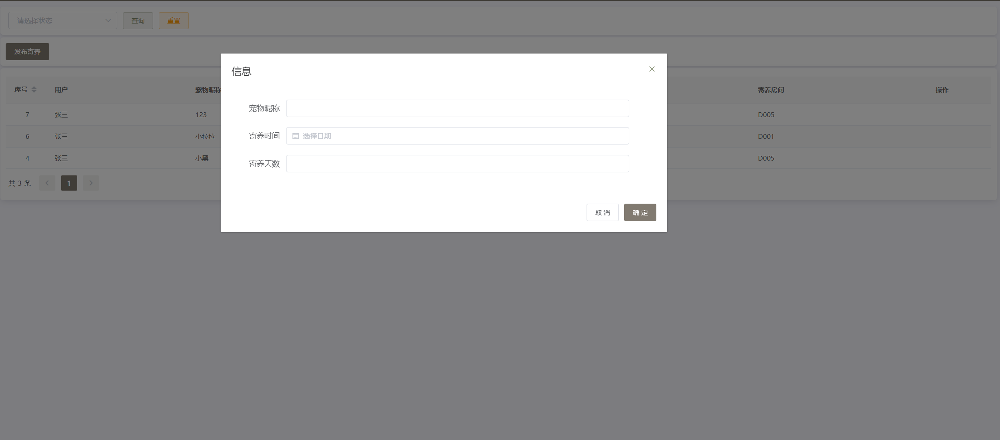

图5.7 宠物寄养发布与列表

宠物寄养发布界面如图5.7所示，宠物寄养列表界面与接口实现方式与宠物领养一致，寄养发布界面整体是一个Form表单，前台用户输入完所有信息后，点击确定按钮，访问服务端接口/foster/add，接口在添加寄养信息之前，首先将寄养状态设置为“待领养”（ADOPT_NO）。通过 foster.setStatus(FosterStatusEnum.ADOPT_NO.status) 将寄养信息对象中的状态属性设置为对应的状态值。然后调用 fosterMapper.insert(foster) 方法，将设置好状态的寄养信息对象插入到数据库中。

#### 流浪宠物申报

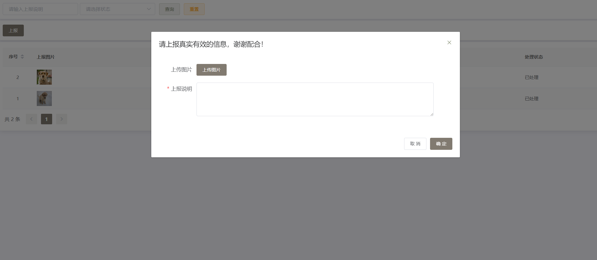

图5.8 流浪宠物申报界面

流浪宠物上报界面如图5.8所示，该界面主要功能为图片上传，前端调用files/upload接口上传图片，上传接口中使用 System.currentTimeMillis() 方法获取当前时间戳，并将其作为文件名的一部分，保证文件名的唯一性。通过 ThreadUtil.sleep(1L) 方法确保即使在同一毫秒内执行多次上传操作，也能生成不同的文件名。通过 file.getOriginalFilename() 方法获取上传文件的原始文件名。检查文件存储路径 filePath 是否存在，如果不存在则调用 FileUtil.mkdir(filePath) 方法创建对应的文件夹。使用 FileUtil.writeBytes(file.getBytes(), filePath + flag + "-" + fileName) 方法将上传的文件字节流写入到指定路径下的文件中，文件名格式为时间戳-原始文件名，然后图片获取接口/{flag}通过response.addHeade 方法设置响应头，告诉浏览器以附件形式下载文件，并指定下载文件的文件名。使用 response.setContentType("application/octet-stream") 方法设置响应类型为二进制流，表示要下载的是一个文件。通过 FileUtil.readBytes(filePath + flag) 方法读取指定路径下的文件内容，并将文件内容以字节数组的形式保存在变量 bytes 中。通过 response.getOutputStream() 方法获取响应输出流 os。将读取到的文件字节数组写入到响应输出流中，通过 os.write(bytes) 方法实现。

用户点击确定按钮，访问接口/submit/add，接口使用Insert语句完成申报数据的插入，在插入前将申报状态设置为待处理。

### 宠物用品功能实现

#### 宠物用品查看

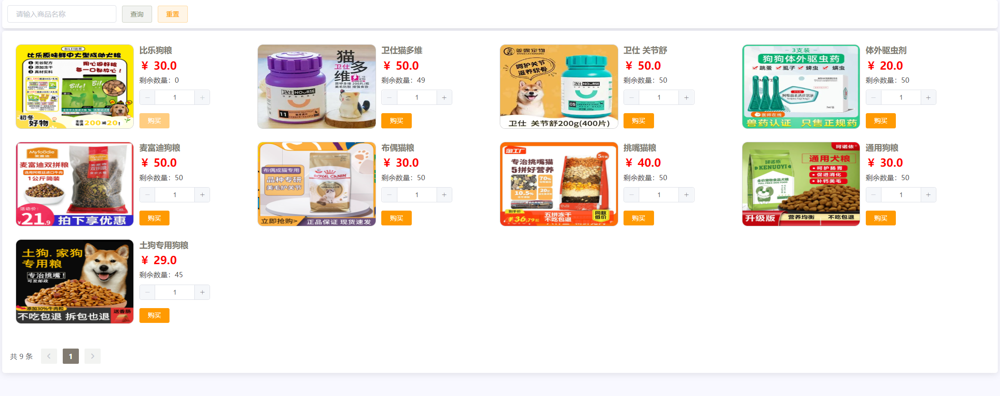

图5.9 宠物用品查看

宠物用品查看界面如图5.9所示，前端在load方法中首先判断传入的 pageNum 是否存在，如果存在，则将其赋值给组件的 pageNum 属性，否则保持原值不变。通过 this.$request.get 方法向服务器端发送 GET 请求，请求的地址为 /goods/selectPage，并传递了一个包含分页参数的参数对象。在请求中，使用 params 属性传递参数对象，其中包括了当前页码 pageNum、每页显示数量 pageSize、以及可选的商品名称 name。当服务器返回响应时，在 .then 方法中获取响应数据 res.data。如果响应数据中存在 list 属性，则将其赋值给组件的 tableData 属性，该属性用于存储当前页的商品列表数据；如果存在 total 属性，则将其赋值给组件的 total 属性，该属性表示总记录数。根据获取到的数据更新界面显示，将商品列表数据展示在页面上。

#### 宠物用品够买

宠物用品够买界面如图5.10所示，用户输入完所有基本信息后，点击确定按钮，访问服务端接口orders/add，服务端调用ordersService的add函数，首先，通过订单中的用户ID查询用户信息，获取用户的账户余额。然后，判断用户的账户余额是否足够支付订单的总价。如果余额不足，则抛出自定义异常 ACCOUNT_LOW_ERROR，表示账户余额不足以支付订单。接下来，如果用户余额足够支付订单，则开始创建订单。首先设置订单的创建时间为当前时间，并生成订单编号，采用了当前日期时间的格式化字符串作为订单编号，确保订单编号的唯一性。然后将订单插入到订单表中。接着，更新用户的账户余额，将订单的总价从用户的账户余额中扣除。最后，更新商品库存，根据订单中的商品ID查询商品信息，将订单中购买的商品数量从商品库存中扣除，并更新商品信息到数据库中。

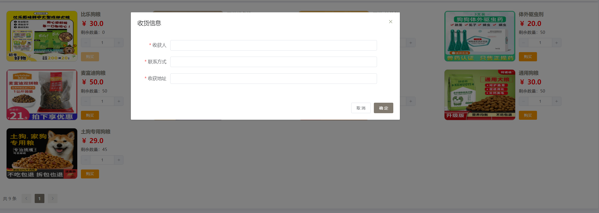

图5.10 宠物用品购买

#### 订单查看

图5.11 订单信息列表

订单信息列表如图5.11所示，用户可以操作订单状态为待发货的数据，当用户点击确认收货按钮，判断方式为v-if="scope.row.status === '待收货' && user.role === 'USER'"，前端通过Axios请求服务端接口：/orders/update，传入当前订单的主键，服务端通过Update语句与主键进行订单数据的修改，完成订单收货。

### 个人信息修改实现

个人信息修改界面如图5.12所示，前台用户可以修改个人基本信息，实现过程，用户点击保存按钮，前端通过函数/user/update，传入修改后的数据，服务端通过Update语句进行数据的修改，在修改的同时通过Select count语句判断关键数据是否重复，用户还可以进行充值操作，点击充值按钮，前端显示充值弹窗，通过visible.sync实现，用户输入充值金额后，访问服务端接口：/user/update，因为充值的金额字段同样来自用户表，同样的Update语句，完成金额充值。

图5.12 个人信息修改

### 后台管理系统实现

#### 前台用户管理

图5.13 前台用户列表

前台用户管理列表界面如图5.13所示，界面使用了ELM UI 的table组件，前端获取到服务端的数据，然后使用table组件循环展示列表内容，并使用template与el-img组件渲染图片，然后后台用户可以进行内容模糊查询与删除操作，通过Axios请求服务端接口，然后服务端进行delete语句完成数据删除，与等于关键字完成模糊查询。

#### 宠物信息管理

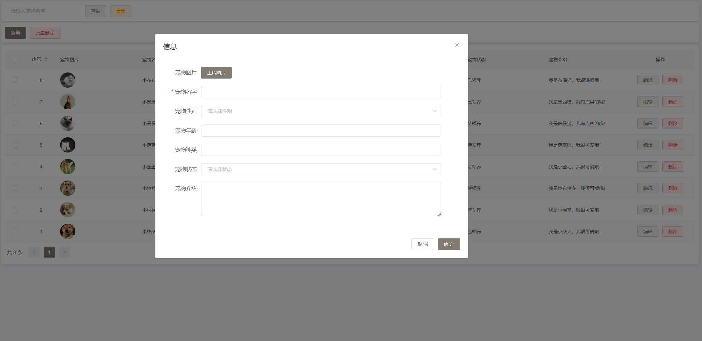

图5.14 宠物信息管理界面

宠物信息管理界面如图5.14所示，用户可以进行宠物名称的精确查询，通过Select关键字实现，也可以进行分页查询，前端使用了分页组件el-pagination，服务端使用了分页插件PageHelper，后台用户点击新增按钮，前端弹出新增弹窗，后台用户输入完所有信息后，访问服务端接口/animal/add，服务端使用Insert语句向数据库中插入新增的宠物数据，用户还可以对宠物数据进行删除操作，服务端通过Delete语句实现。

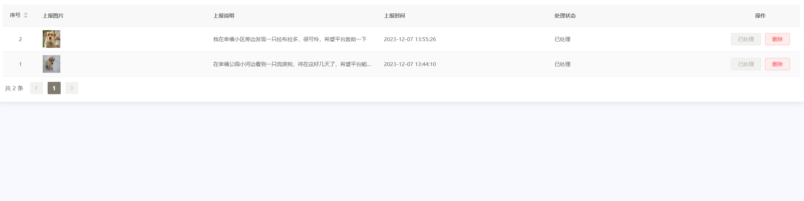

图5.15 流浪宠物领养管理界面

流浪宠物领养管理界面如图5.15所示，后台用户点击处理按钮，前端通过deal函数访问服务端接口：/submit/update，服务端通过Update语句修改改流浪宠物的处理状态，然后在通过Insert语句进行宠物数据的添加，整体由声明式事务@Transactional控制，以此保证数据的原子性。

#### 寄养管理

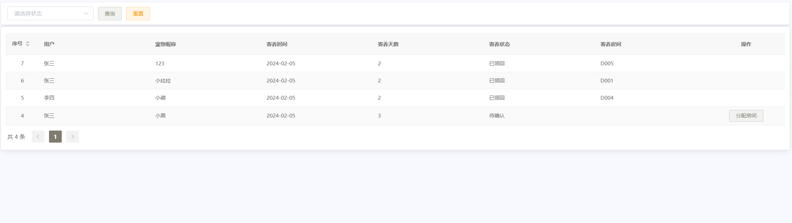

图5.16 寄养列表

寄养列表界面如图5.16所示，后台用户可以处理待确认与寄养中的数据，前端通过v-if="user.role === 'ADMIN' && scope.row.status === '寄养中'"实现，因为后台寄养界面与前台寄养界面为同一个界面，当后台用户点击分配房间按钮，系统弹出弹窗，并展示下拉框，下拉框中的数据为空闲房间数据，通过关联查询实现，使用left join关键字，后台用户点击确认，访问服务端接口：/foster/update，服务端调用 fosterMapper 的 updateById 方法更新数据库中的寄养信息记录，即根据 foster 对象中的信息更新数据库中对应的记录。根据 foster 对象中的 roomId 属性查询对应的房间信息。这里使用 roomMapper 的 selectById 方法根据 roomId 查询房间信息。判断查询到的 room 对象是否为空。如果不为空，则说明找到了对应的房间信息。根据 foster 对象中的 status 属性判断寄养状态。将房间的状态修改为占用。将房间对应的在养宠物名称更新为 foster 对象中的宠物名称。最后，通过 roomMapper 的 updateById 方法将更新后的房间信息写入数据库。

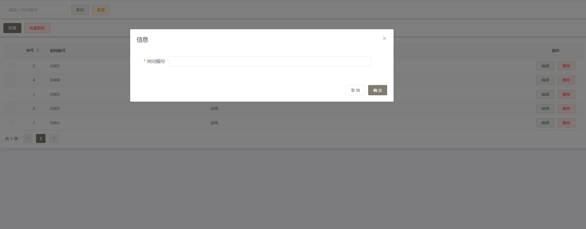

图5.17 分配房间

#### 宠物用品管理

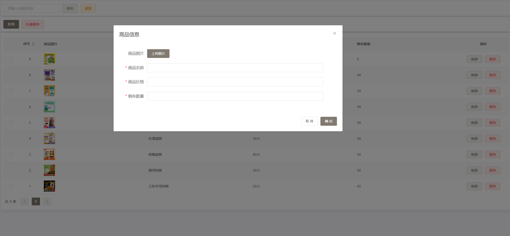

图5.18 宠物用品管理界面

宠物用品管理界面如图5.18所示，后台用户除了查询，编辑，删除操作外，还可以进行宠物用品的增加。

订单管理界面如图5.19所示，后台用户可以查看所有订单数据，后台用户可以进行订单发货处理，点击发货按钮，访问服务端接口：/orders/update，服务端通过Update语句修改订单的状态，前台用户就可以进行订单收货操作。

图5.19 订单管理

## 系统测试

### 测试环境与方法

本系统的测试环境为Windows 10操作系统，使用Chrome、Firefox、Edge等主流浏览器进行测试。测试过程中使用的工具包括WebStorm、IDEA、Node.js、Navicat等。

测试方法采用黑盒测试方法，主要对系统的登录、宠物信息、宠物用品、寄养管理等模块进行测试。测试人员按照系统设计的流程，测试系统是否能够正常运行、数据是否准确、用户界面是否友好等方面进行测试。

### 测试用例

#### 登录测试

前台用户登录接口与后台用户登录接口为同一个接口，在本次测试用例中，除了测试账号与密码是否可以通过验证外，还需测试不同用户登录看到的菜单是否不同，是否做了区分，测试用例如表6.1所示。

表6.1 登录测试用例表

<table>
<tr><td>测试序号</td><td>操作描述</td><td>数据</td><td>期望结果</td><td>实际结果</td><td>测试状态</td></tr>
<tr><td>1</td><td>前台用户登录（账号为cs，密码为：123456）</td><td>账号cs，密码123456</td><td>登录成功</td><td>登录成功，看到的界面为前台用户界面</td><td>通过</td></tr>
<tr><td>2</td><td>前台用户登录（账号为cs，密码为：123456）</td><td>账号cs2，密码123456</td><td>账号错误</td><td>账号错误</td><td>通过</td></tr>
<tr><td>3</td><td>后台用户登录（账号为admin，密码为：123456）</td><td>账号admin，密码1234561</td><td>密码错误</td><td>密码错误</td><td>通过</td></tr>
<tr><td>4</td><td>后台用户登录（账号为admin，密码为：123456）</td><td>账号admin，密码123456</td><td>登录成功</td><td>登录成功，界面为后台用户界面</td><td>通过</td></tr>
</table>

#### 宠物信息测试

宠物信息测试，主要测试前台用户是否可以正常领养宠物，寄养宠物，放弃领养宠物，上报流程宠物信息，测试结果如表6.2所示。

表6.2 宠物信息测试

<table>
<tr><td>测试序号</td><td>操作描述</td><td>数据</td><td>期望结果</td><td>实际结果</td><td>测试状态</td></tr>
<tr><td>1</td><td>前台用户领养宠物1（待领养）</td><td>宠物1</td><td>领养成功</td><td>领养成功</td><td>通过</td></tr>
<tr><td>2</td><td>另外一名前台用户领养宠物1·</td><td>宠物1</td><td>无法领养</td><td>无法领养</td><td>通过</td></tr>
<tr><td>3</td><td>前台用户，放弃领养宠物1</td><td>宠物1</td><td>放弃领养成功</td><td>操作成功</td><td>通过</td></tr>
<tr><td>4</td><td>前台用户寄养宠物2</td><td>宠物2</td><td>寄养成功</td><td>寄养成功</td><td>通过</td></tr>
<tr><td>5</td><td>前台用户上报流浪宠物1</td><td>流浪宠物1</td><td>上报成功</td><td>上报成功</td><td>通过</td></tr>
</table>

#### 宠物用品测试

宠物用品测试主要测试库存不足的商品是否可以被购买，金额不足的用户是否可以购买超支的商品，测试结果如表6.3所示。

表6.3 宠物用品测试

<table>
<tr><td>测试序号</td><td>操作描述</td><td>数据</td><td>期望结果</td><td>实际结果</td><td>测试状态</td></tr>
<tr><td>1</td><td>未登录的前台用户购买宠物用品</td><td>宠物用品</td><td>请登录</td><td>请登录，跳转登录界面</td><td>通过</td></tr>
<tr><td>2</td><td>登录过的前台用户购买数量为0的宠物用品</td><td>宠物用品</td><td>按钮置灰，无法购买</td><td>按钮置灰，无法购买</td><td>通过</td></tr>
<tr><td>3</td><td>金额为20的前台用户购买宠物用品，总金额为50</td><td>宠物用品</td><td>购买失败</td><td>余额不足</td><td>通过</td></tr>
</table>

#### 寄养管理测试

寄养管理主要测试后台用户是否可以正常的进行待确认数据的房间分配，后台用户是否可以增加新的房间，后台用户是否可以操作寄养中的数据，测试结果如表6.4所示。

表6.4 寄养管理测试

<table>
<tr><td>测试序号</td><td>操作描述</td><td>数据</td><td>期望结果</td><td>实际结果</td><td>测试状态</td></tr>
<tr><td>1</td><td>未登录的后台用户访问寄养管理</td><td>寄养管理查询参数</td><td>请登录</td><td>请登录</td><td>通过</td></tr>
<tr><td>2</td><td>登录过的后台用户为寄养宠物1分配房间</td><td>寄养宠物1，房间</td><td>分配成功</td><td>操作成功</td><td>通过</td></tr>
<tr><td>3</td><td>后台用户操作寄养宠物1</td><td>寄养宠物1</td><td>领回成功，房间空闲</td><td>操作成功</td><td>通过</td></tr>
<tr><td>4</td><td>后台用户增加新的房间1</td><td>房间1</td><td>增加成功</td><td>操作成功</td><td>通过</td></tr>
</table>

## 结论

本文设计并实现了一个功能完善的宠物领养管理系统，旨在满足管理员和用户在宠物领养管理方面的各种需求。管理员角色具备系统的最高权限，能够对系统所有数据进行全面管理和维护。管理员需要实现登录功能以确保系统的安全性，并具备查看和编辑个人信息、修改密码的功能以保障账户安全。

宠物领养管理系统包括宠物信息管理、宠物房间管理、宠物领养管理、宠物寄养管理、宠物用品管理、订单信息管理、流浪宠物上报管理、系统公告管理、管理员信息管理和用户信息管理等多个模块。管理员可以在系统中对这些模块进行全面的管理，包括添加、编辑、删除信息，确保数据的准确性和完整性。

通过以上功能模块的设计和实现，宠物领养管理系统能够为管理员和用户提供一个高效、便捷、安全的宠物领养管理平台。管理员可以对宠物信息进行全面管理，包括领养、寄养、用品等各方面，从而提升宠物领养管理的规范性和效率。用户可以在平台上方便地浏览宠物信息、领养、寄养宠物，购买宠物用品等，满足他们的宠物需求，提升用户体验。

总之，宠物领养管理系统的建立将为管理员和用户提供一个便捷、安全、高效的宠物领养管理平台，促进宠物领养、寄养等活动的规范化和合理化发展。
